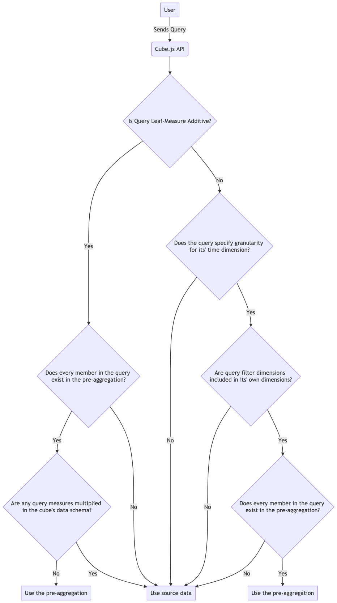

Often at the beginning of an analytical application's lifecycle - when there is
a smaller dataset that queries execute over - the application works well and
delivers responses within acceptable thresholds. However, as the size of the
dataset grows, the time-to-response from a user's perspective can often suffer
quite heavily. This is true of both application and purpose-built data
warehousing solutions.

This leaves us with a chicken-and-egg problem; application databases can deliver
low-latency responses with small-to-large datasets, but struggle with massive
analytical datasets; data warehousing solutions _usually_ make no guarantees
except to deliver a response, which means latency can vary wildly on a
query-to-query basis.

| Database Type                  | Low Latency? | Massive Datasets? |
| ------------------------------ | ------------ | ----------------- |
| Application (Postgres/MySQL)   | ✅           | ❌                |
| Analytical (BigQuery/Redshift) | ❌           | ✅                |

Cube.js provides a solution to this problem: pre-aggregations. In layman's
terms, a pre-aggregation is a condensed version of the source data. It specifies
attributes from the source, which Cube.js uses to condense (or crunch) the data.
This simple yet powerful optimization can reduce the size of the dataset by
several orders of magnitude, and ensures subsequent queries can be served by the
same condensed dataset if any matching attributes are found.

[Pre-aggregations are defined within each cube's data
schema][ref-schema-preaggs], and cubes can have as many pre-aggregations as they
require. The pre-aggregated data [can be stored either alongside the source data
in the same database, in an external database][ref-schema-preaggs-extvsint] that
is supported by Cube.js, [or in Cube Store, a dedicated pre-aggregation storage
layer][ref-caching-preaggs-cubestore].

## Pre-Aggregations without Time Dimension

To illustrate pre-aggregations with an example, let's use a sample e-commerce
database. We have a schema representing all our `Orders`:

```javascript
cube(`Orders`, {
  sql: `SELECT * FROM public.orders`,

  measures: {
    count: {
      type: `count`,
      drillMembers: [id, createdAt],
    },
  },

  dimensions: {
    status: {
      sql: `status`,
      type: `string`,
    },

    id: {
      sql: `id`,
      type: `number`,
      primaryKey: true,
    },

    completedAt: {
      sql: `completed_at`,
      type: `time`,
    },
  },
});
```

Some sample data from this table might look like:

| **id** | **status** | **completed_at**        |
| ------ | ---------- | ----------------------- |
| 1      | completed  | 2021-02-15T12:21:11.290 |
| 2      | completed  | 2021-02-25T18:15:12.369 |
| 3      | shipped    | 2021-03-15T20:40:57.404 |
| 4      | processing | 2021-03-13T10:30:21.360 |
| 5      | completed  | 2021-03-10T18:25:32.109 |

Our first requirement is to populate a dropdown in our front-end application
which shows all possible statuses. The Cube.js query to retrieve this
information might look something like:

```json
{
  "dimensions": ["Orders.status"]
}
```

```javascript
cube(`Orders`, {
  // Same content as before, but including the following:
  preAggregations: {
    orderStatuses: {
      type: `rollup`,
      dimensionReferences: [status],
    },
  },
});
```

## Pre-Aggregations with Time Dimension

Using the same schema as before, we are now finding that users frequently query
for the number of orders completed per day, and that this query is performing
poorly. This query might look something like:

```json
{
  "measures": ["Orders.count"],
  "timeDimensions": ["Orders.completedAt"]
}
```

In order to improve the performance of this query, we can add another
pre-aggregation definition to the `Orders` schema:

```javascript
cube(`Orders`, {
  // Same content as before, but including the following:
  preAggregations: {
    ordersByCompletedAt: {
      type: `rollup`,
      measureReferences: [count],
      timeDimensionReference: completedAt,
      granularity: `month`,
    },
  },
});
```

Note that we have added a `granularity` property with a value of `month` to this
definition. [This allows Cube.js to aggregate the dataset to a single entry for
each month][ref-schema-preaggs-examples].

The next time the API receives the same JSON query, Cube.js will build (if it
doesn't already exist) the pre-aggregated dataset, store it in the source
database server and use that dataset for any subsequent queries. A sample of the
data in this pre-aggregated dataset might look like:

| **completed_at**        | **count** |
| ----------------------- | --------- |
| 2021-02-01T00:00:00.000 | 2         |
| 2021-03-01T00:00:00.000 | 3         |

## Keeping pre-aggregations up-to-date

Pre-aggregations can become out-of-date or out-of-sync if the original dataset
changes. [Cube.js uses a refresh key to check the freshness of the
data][ref-caching-preaggs-refresh]; if a change in the refresh key is detected,
the pre-aggregations are rebuilt.

These refreshes can be done on-demand, or [in the background as a scheduled
process][ref-caching-preaggs-bk-refresh].

## Ensuring pre-aggregations are targeted by queries

### Additivity

So far, we've described pre-aggregations as aggregated versions of your existing
data.

However, there are some rules that apply to when Cube.js uses the
pre-aggregation. The "additivity" of fields specified in both the query and in
the pre-aggregation determine this.

So what is additivity? Let's add another cube called `LineItems` to the previous
example to demonstrate. The `LineItems` "belong to" the `Orders` cube, and are
[joined][ref-schema-joins] as such:

```javascript
cube(`LineItems`, {
  sql: `SELECT * FROM public.line_items`,

  joins: {
    Orders: {
      sql: `${CUBE}.order_id = ${Orders}.id`,
      relationship: `belongsTo`,
    },
  },

  measures: {
    count: {
      type: `count`,
      drillMembers: [id, createdAt],
    },
  },

  dimensions: {
    id: {
      sql: `id`,
      type: `number`,
      primaryKey: true,
    },

    createdAt: {
      sql: `created_at`,
      type: `time`,
    },
  },
});
```

Some sample data from the `line_items` table might look like:

| **id** | **product_id** | **order_id** | **quantity** | **price** | **profit_margin** | **created_at**             |
| ------ | -------------- | ------------ | ------------ | --------- | ----------------- | -------------------------- |
| 1      | 31             | 1            | 1            | 275       | 1                 | 2019-01-31 00:00:00.000000 |
| 2      | 49             | 2            | 6            | 248       | 0.1               | 2021-01-20 00:00:00.000000 |
| 3      | 89             | 3            | 6            | 197       | 0.2               | 2021-11-25 00:00:00.000000 |
| 4      | 71             | 4            | 8            | 223       | 0.15              | 2019-12-23 00:00:00.000000 |
| 5      | 64             | 5            | 5            | 75        | 0.7               | 2019-04-20 00:00:00.000000 |

Looking at the raw data, we can see that if the data were to be aggregated by
day (for example), then we could simply add together the `quantity` and `price`
fields. This means that `quantity` and `price` are both "additive measures", and
we can represent them in the `LineItems` schema as follows:

```javascript
cube(`LineItems`, {
  ...,
  measures: {
    ...,
    quantity: {
      sql: `quantity`,
      type: `sum`,
    },
    price: {
      type: `sum`,
      sql: `price`,
      format: `currency`,
    },
  },
  ...,
});
```

Because neither `quantity` and `price` reference any other measures in our
`LineItems` cube, we can also say that they are "additive leaf measures". Any
query requesting only these two measures can be called a "leaf measure additive"
query.

### Non-Additivity

Using the same sample data for `line_items`, there's a `profit_margin_pct` field
which is different for each row. However, despite the value being numerical, it
doesn't actually make sense to add up this value - doing so with the sample data
would result in a 215% profit margin which (unfortunately) is not correct. We
can add the `profit_margin_pct` field to our schema like this:

```javascript
cube(`LineItems`, {
  ...,
  measures: {
    ...,
    profitMargin: {
      sql: `profit_margin`,
      type: `number`,
      format: 'percentage',
    },
  },
  ...,
});
```

Another example of a non-additive measure would be a distinct count of
`product_id`. If we took the distinct count of products sold over a month, and
then tried to sum the distinct count of products for each individual day and
compared them, we would not get the same results. We can add the measure like
this:

```javascript
cube(`LineItems`, {
  ...,
  measures: {
    ...,
    countDistinctProducts: {
      sql: `product_id`,
      type: `countDistinct`,
    },
  },
  ...,
});
```

### How additivity plays a role in pre-aggregation selection

To recap what we've learnt so far:

- "Additive measures" are measures whose values can be added together.
- "Multiplied" measures are measures that define `hasMany` relations.
- "Leaf measures" are measures that do not reference any other measures in their
  definition.
- A query is "leaf measure additive" if all of its leaf measures are one of:
  `count`, `sum`, `min`, `max` or `countDistinctApprox`.

Cube.js selects the best available pre-aggregation based on the incoming queries
it receives via the API.

Some considerations:

- The query's time dimension and granularity together act as a dimension. If the
  date range isn't aligned with granularity, a common granularity is used. To
  match granularity date range, its start date and end date should match. For
  example, for month it's ['2020-01-01T00:00:00.000', '2020-01-31T23:59:59.999']
  and for day it's ['2020-01-01T00:00:00.000', '2020-01-01T23:59:59.999']. Date
  ranges are inclusive. The minimum granularity is `second`.
- The order in which pre-aggregations are defined in schemas matter; the first
  matching pre-aggregation for a query is the one that is used. Cubes of a
  measures and then cubes of dimensions are checked to find a matching `rollup`.
  However `rollup` pre-aggregations always have priority over `originalSql`.
  Thus, if you have both `originalSql` and `rollup` defined, Cube.js will try to
  find matching `rollup` before trying to find matching `originalSql`.
  Furthermore, you can instruct Cube.js to use original sql pre-aggregations
  using [`useOriginalSqlPreAggregations`][ref-orig-sql].

Cube.js selects the best available pre-aggregation based on the incoming queries
it receives via the API. The process for selection is outlined in the diagram
below:



[ref-schema-preaggs-examples]: /pre-aggregations#rollup-rollup-examples
[ref-schema-joins]: /joins
[ref-caching-preaggs-cubestore]:
  /caching/using-pre-aggregations#pre-aggregations-storage
[ref-caching-preaggs-bk-refresh]:
  /caching/using-pre-aggregations#background-refresh
[ref-caching-preaggs-refresh]: /caching/using-pre-aggregations#refresh-strategy
[ref-schema-preaggs]: /pre-aggregations
[ref-schema-preaggs-extvsint]: /pre-aggregations#external-vs-internal
